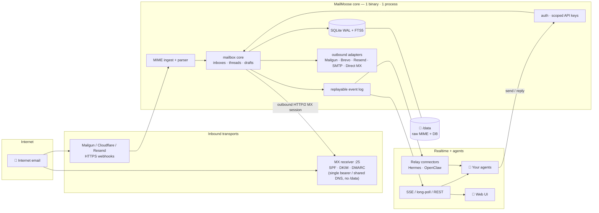

<div align="center">


# MailMoose

**Open email infrastructure for AI agents.**

Unlimited logical inbox identities, realtime replayable events, BYO outbound delivery — self-hosted in one container.

[](https://github.com/dellarb/mailmoose/actions/workflows/ci.yml)
[](LICENSE)
[](CONTRIBUTING.md)

</div>

> [!WARNING]
> **MailMoose is in active development and is not yet production-ready.**
> APIs, configuration, and on-disk formats may change without notice before
> the first stable release. Kick the tyres, break things, and tell us what's
> missing — but don't point it at anything you depend on yet.

---

## The 5-Second Hook

Your agents need email. Not an API wrapper around someone else's inbox — real
addresses that receive mail, hold history, and send through providers you
control.

Today the options are bad: SaaS mail APIs give you one shared inbox per
provider and lock your agent's identity to their platform. DIY Postfix gives
you an ops project, not a feature.

MailMoose gives every agent its own address — `research@yourdomain.com`,
`task-8291@yourdomain.com`, as many as you want — with full-text search,
durable event streams, scoped API keys, and sending through Mailgun, Brevo,
Resend, Direct MX, or any SMTP relay you already pay for. Self-host the
whole thing in a single container.

## Why MailMoose vs Alternatives

| | **MailMoose** | SaaS mail APIs | DIY Postfix + IMAP |
|---|---|---|---|
| **Speed** | Events delivered in-process the moment the webhook lands; agents catch up after downtime by replaying a cursor | Webhook per provider, each with its own retry/dedup semantics to babysit | Poll-only unless you build IMAP IDLE handling yourself |
| **Developer experience** | One bearer key, agent self-discovery (`/.well-known`, `/agent`, OpenAPI), scoped roles per inbox | One SDK per provider; permission models built for humans, not agents | You own TLS, spam, auth, parsing, and a stateful daemon forever |
| **Footprint** | 1 binary · 1 process · 1 SQLite DB · 1 `./data` directory | Zero (your data lives on their servers) | Multiple daemons, mail queues, and config files to back up and secure |

## Quickstart

Running in under two minutes — no clone, no build:

**1. Create a folder** with `docker-compose.yml`:

```yaml
services:
  mailmoose:
    image: ghcr.io/dellarb/mailmoose:latest
    restart: unless-stopped
    env_file: .env
    volumes:
      - ./data:/data        # all persistent state lives here
    ports:
      - "8081:8081"         # API + web UI (webhook ingest also works here)
```

**2. Create** `.env`:

```bash
APP_ENCRYPTION_KEY=$(openssl rand -hex 32)   # back this up — it decrypts provider secrets
BASE_URL=https://mail.example.com            # where you'll reach this instance
ADMIN_EMAIL=admin@example.com
ADMIN_PASSWORD=a-long-random-password
```

**3. Run it:**

```bash
docker compose up -d
```

Open `BASE_URL`, sign in with the system administrator credentials, and add your domain. From the **Admin** page you can invite other people, each as their own separate account. Then:

- Wire up **inbound and outbound providers** → [docs/PROVIDERS.md](docs/PROVIDERS.md)
- Connect an **agent or service to an inbox** (Hermes Relay, OpenClaw, webhook, API key) → [docs/CONNECTORS.md](docs/CONNECTORS.md)
- Direct-SMTP (MX) on port 25 — choose the receiver under **Admin → MX receiver** (Included or Remote) — hardened stacks, reverse-proxy settings → [docs/SELFHOSTING.md](docs/SELFHOSTING.md) and [docs/MX.md](docs/MX.md)
- Build from source → the repo's [`docker-compose.yml`](docker-compose.yml) + [CONTRIBUTING.md](CONTRIBUTING.md)

## Key Features

- **Give every agent its own identity.** Inboxes are lightweight database rows — spin up per-role, per-project, or per-task addresses instantly, with aliases, catch-all routing, and API keys scoped to exactly the mailboxes each agent should touch (`read` / `assistant` / `owner`).
- **Never miss a message, never process one twice.** Every event is a durable SQLite row with a cursor; agents reconnect after a crash and replay the backlog, and inbound webhooks are deduplicated on the provider's authenticated delivery token.
- **Ship mail through providers you already trust.** Bring your own Mailgun, Brevo, Resend, or SMTP credentials — configured per domain, encrypted at rest, with the full delivery log visible for every attempt.
- **Own the whole stack without operating it.** One Go binary, one SQLite database, raw MIME on disk under `./data` — backup is copying one directory plus one key.

## Architecture

One process owns the durable truth (SQLite + raw MIME on disk); transports and realtime delivery hang off its edges. The optional MX edge is the only second process — and it holds no database access and no encryption key.



Events are committed to SQLite **before** any realtime fan-out: SSE, long-poll, Relay, and cursor replay all read from the same durable history, so a reconnecting agent never loses a message. Provider-specific code stays in narrow transport packages — the mailbox core is transport-neutral.

## API

Give an agent the origin (`BASE_URL`) and an API key — that's the whole onboarding. Keys are sent as `Authorization: Bearer mmm_...`, and a capable agent can discover everything else itself, starting from:

```text
$BASE/.well-known/mailmoose   # discovery document
$BASE/agent                   # markdown agent guide
$BASE/v1/bootstrap            # key-specific capabilities
$BASE/openapi.json            # full OpenAPI spec
```

Permissions are assigned **per inbox**, so one key can hold different roles on different mailboxes:

| Role | Access |
|---|---|
| `read` | messages, threads, search, attachments |
| `assistant` | read + delete + drafts |
| `owner` | assistant + send/reply + mailbox settings |
| `admin` | account-wide administration |

## Hermes Relay

For [Hermes](https://github.com/NousResearch/hermes) agents, no polling code is needed: in the Admin UI, **Create key → Hermes relay connection**, choose an inbox, and paste the generated `.env` block into the Hermes host. Email delivered to that inbox is replayed to the agent over an authenticated WebSocket, and replies egress through the sending provider configured on the inbox's domain.

Full setup is in [docs/CONNECTORS.md](docs/CONNECTORS.md).

## OpenClaw Connector

For [OpenClaw](https://github.com/openclaw/openclaw) agents, install the MailMoose channel plugin on the OpenClaw host first — it ships in this repository at [`plugins/openclaw/openclaw-plugin`](plugins/openclaw/openclaw-plugin) and is not yet published to npm or ClawHub:

```bash
cd plugins/openclaw/openclaw-plugin
npm ci && npm run build
openclaw plugins install -l . --accept-capabilities --force
```

Then add an **OpenClaw agent connector** to an inbox and run the generated setup command:

```bash
openclaw channels add --channel mailmoose --code https://mail.example.com/#<one-time-code>
```

The plugin must be installed before that command will resolve the `mailmoose` channel. The code is single-use and expires in 15 minutes; the URL carries the MailMoose address and the fragment carries the code. OpenClaw then dials out to `/relay`, receives new mail over the authenticated socket, and replies on the original email thread. No inbound port is required on the OpenClaw host. For air-gapped installs, choose **Manual config block** instead and paste the generated `channels.mailmoose` block. The connector shares the relay transport with Hermes but appears and is managed as its own kind.

Full setup for every connector kind — including webhooks and API keys — is in [docs/CONNECTORS.md](docs/CONNECTORS.md).

## Contributing

MailMoose is V1 with a deliberately small scope, and that's an invitation: the
fastest way to shape it is to use it and tell us what's missing.

- ⭐ **Star the repo** if agent-native email is a problem you care about.
- 🐛 **Open issues** for bugs and API gaps.
- 🔧 **Send PRs** — see [CONTRIBUTING.md](CONTRIBUTING.md) for the Docker-based
  toolchain, test expectations, and the formatting gate.
- 🔒 **Security issues**: never open a public issue — follow
  [SECURITY.md](SECURITY.md).

## Documentation

| Doc | Contents |
|---|---|
| [docs/PROVIDERS.md](docs/PROVIDERS.md) | Inbound (Mailgun, Cloudflare, Resend, MX) and outbound (Mailgun, Brevo, Resend, SMTP) setup |
| [docs/CONNECTORS.md](docs/CONNECTORS.md) | Inbox-level connectors: Hermes Relay, OpenClaw, webhooks and API keys |
| [docs/SELFHOSTING.md](docs/SELFHOSTING.md) | First-run admin, reverse proxy, MX modes and tuning, hardening, backup, upgrades |
| [docs/MX.md](docs/MX.md) | Direct-SMTP edge: wire contract, auth policy, spam and retry semantics |
| [docs/API-REFERENCE.md](docs/API-REFERENCE.md) | Generated REST API reference |
| [docs/ARCHITECTURE.md](docs/ARCHITECTURE.md) | Runtime topology, package boundaries, persistence model |
| [docs/DECISIONS.md](docs/DECISIONS.md) | The settled architectural decision register |

## License

MailMoose is licensed under the GNU Affero General Public License v3.0
([AGPL-3.0](LICENSE)). Third-party components and their licences are listed in
[THIRD_PARTY_NOTICES.md](THIRD_PARTY_NOTICES.md).
